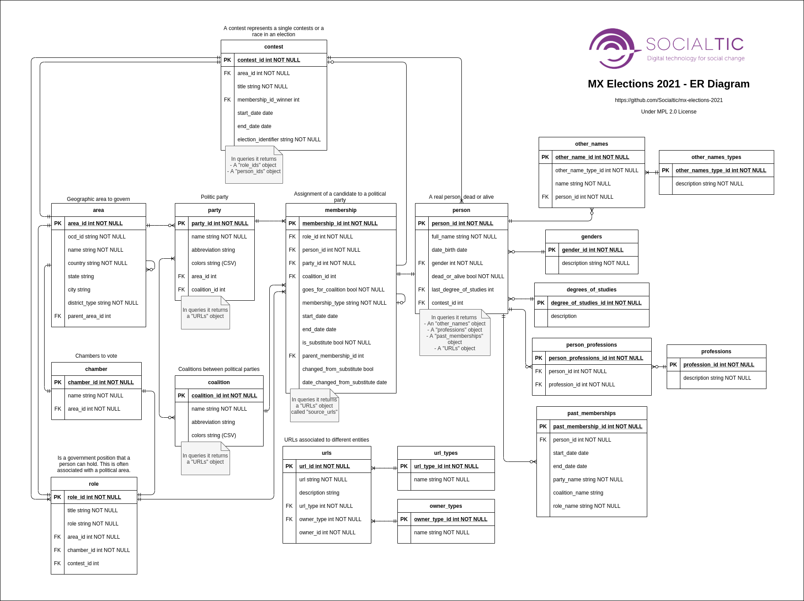

#  Endpoints description

##  ER model

Diagrams can be found in [docs folder](./).

- [XML version](./mx-elections-2021-db-er-diagram.xml) from [diagrams.net](diagrams.net)
- [PNG version](./mx-elections-2021-db-er-diagram.png)



## Endpoints

###    person

#### URL

[https://www.apielectoral.mx/person/< id >](https://www.apielectoral.mx/person)

#### Fields

|field_name             |require for input?|type            |description                                     |input value example                         |output value example                                                                                                                                                                                                |notes                                                                                                            |
|-----------------------|------------------|----------------|------------------------------------------------|--------------------------------------------|--------------------------------------------------------------------------------------------------------------------------------------------------------------------------------------------------------------------|-----------------------------------------------------------------------------------------------------------------|
|person_id              |no                |int             |Unique identifier                               |1                                           |1                                                                                                                                                                                                                   |On query the name of the field is id                                                                             |
|first_name             |**yes**           |string(50)      |First name of the person                        |Marina del Pilar                            |{<br/>&emsp;"en_US": "Marina del Pilar",<br/>&emsp;"es_MX": "Marina del Pilar"<br/> }                                                                                                                               |The output is on en_US and es_MX locales.                                                                        |
|last_name              |**yes**           |string(50)      |Last name of the person                         |Ávila Olmeda                                |{<br/>&emsp;"en_US": "Ávila Olmeda",<br/>&emsp;"es_MX": "Ávila Olmeda"<br/>}                                                                                                                                        |The output is on en_US and es_MX locales.                                                                        |
|full_name              |**yes**           |string(100)     |Full name of the person                         |Marina del Pilar Ávila Olmeda               |{<br/>&emsp;"en_US": "Marina del Pilar Ávila Olmeda",<br/>&emsp;"es_MX": "Marina del Pilar Ávila Olmeda"<br/>}                                                                                                      |The output is on en_US and es_MX locales.                                                                        |
|date_birth             |no                |date            |Birth date of the person                        |1985-09-19                                  |1985-09-19                                                                                                                                                                                                          |Date format is YYYY-MM-DD                                                                                        |
|gender                 |**yes**           |int             |Gender of the person.                           |2                                           |F                                                                                                                                                                                                                   |1 for male 2 for female                                                                                          |
|dead_or_alive          |**yes**           |boolean         |True if person is alive. Dead if person is dead.|true                                        |true                                                                                                                                                                                                                |-                                                                                                                |
|last_degree_of_studies |no                |int             |id of the last degree of studies.               |6                                           |MASTER DEGREE                                                                                                                                                                                                       |The id should exists as a valid degree of studies in range between [1,7].  Verify the degrees_of_studies catalog.|
|contest_id             |no                |int             |id of the associated contest.                   |301                                         |301                                                                                                                                                                                                                 |The id should exists on contest table.                                                                           |
|other_names            |no                |array of object |Other names for the person.                     |Info available on other-name endpoint       |{<br/>&emsp;"ballot_name": [],<br/>&emsp;"nickname": [<br/>&emsp;&emsp;{<br/>&emsp;&emsp;&emsp;"en_US": "Dr Aguilar"<br/>&emsp;&emsp;},<br/>&emsp;&emsp;{<br/>&emsp;&emsp;&emsp;"es_MX": "Dr Aguilar"<br/>&emsp;&emsp;}<br/>&emsp;],<br/>&emsp;"preferred_name": []<br/>}|Valid keys are ["preferred", "nickname", "ballot_name"]  The output is on en_US and es_MX locales. |
|professions            |no                |array of string |Related professions for the person.             |Info available on person-profession endpoint|[<br/>&emsp;"Law",<br/>&emsp;"Public administration",<br/>&emsp;"Educational planning and evaluation"<br/>]                                                                                                         |-                                                                                                               |
|fb_urls                |no                |array of object |A list of FB urls belong to this person.        |Info available on url endpoint              |[<br/>&emsp;{<br/>&emsp;&emsp;"note": "campaign",<br/>&emsp;&emsp;"url": "https://www.facebook.com/facebook/"<br/>&emsp;} <br/>]                                                                                    |Valid note values are ["campaign", "official", "personal"]  Valid URL format.                                   |
|ig_urls                |no                |array of object |A list of IG urls belong to this person.        |Info available on url endpoint              |[<br/>&emsp;{<br/>&emsp;&emsp;"note": "campaign",<br/>&emsp;&emsp;"url": "https://www.instagram.com/instagram/"<br/>&emsp;} <br/> ]                                                                                 |Valid note values are ["campaign", "official", "personal"]  Valid URL format.                                   |
|social_network_accounts|no                |array of object |Other non-FB social media accounts.             |Info available on url endpoint              |[<br/>&emsp;{<br/>&emsp;&emsp;"type": "Twitter",<br/>&emsp;&emsp;"value": "exampletwitter"<br/>&emsp;},<br/>&emsp;{<br/>&emsp;&emsp;"type": "YouTube",<br/>&emsp;&emsp;"value": "exampleyoutube"<br/>&emsp;&emsp;}<br/>] |Valid type values are ["Twitter", "YouTube", "LinkedIn", "Flickr", "Pinterest", "Tumblr", "RSS"]            |
|websites               |no                |array of object |Official/Campaign websites of the person.       |Info available on url endpoint              |[<br/>&emsp;{<br/>&emsp;&emsp;"note": "official",<br/>&emsp;&emsp;"url": "https://www.official.com"<br/>&emsp;},<br/>&emsp;{<br/>&emsp;&emsp;"note": "campaign",<br/>&emsp;&emsp;"url": "https://www.campaign.com"<br/>&emsp;}<br/>] |Valid note values are ["campaign", "personal", "wikipedia"]  Valid URL format.                  |
|photo_urls             |no                |array of strings|URLs to person photos.                          |Info available on url endpoint              |[<br/>&emsp;"https://www.example.com/pub/photos/p1.jpg",<br/>&emsp;"https://www.example.com/pub/photos/p2.png" <br/> ]                                                                                                    |Valid URL format.                                                                                                |

#### Output

[https://www.apielectoral.mx/person/1](https://www.apielectoral.mx/person/1)

```json
{
  "person": {
    "contest_id": 301,
    "date_birth": "1985-09-19",
    "dead_or_alive": true,
    "fb_urls": [
      {
        "note": "campaign",
        "url": "https://www.facebook.com/MarinadelpilarBc"
      }
    ],
    "first_name": {
      "en_US": "Marina del Pilar",
      "es_MX": "Marina del Pilar"
    },
    "full_name": {
      "en_US": "Marina del Pilar Ávila Olmeda",
      "es_MX": "Marina del Pilar Ávila Olmeda"
    },
    "gender": "F",
    "id": 1,
    "ig_urls": [
      {
        "note": "campaign",
        "url": "https://www.instagram.com/marinadelpilar_ao"
      }
    ],
    "last_degree_of_studies": "MASTER DEGREE",
    "last_name": {
      "en_US": "Ávila Olmeda",
      "es_MX": "Ávila Olmeda"
    },
    "other_names": {
      "ballot_name": [],
      "nickname": [],
      "preferred_name": []
    },
    "photo_urls": [],
    "professions": [
      "Law",
      "Public administration",
      "Educational planning and evaluation"
    ],
    "social_network_accounts": [],
    "websites": [
      {
        "note": "official",
        "url": "https://www.marinadelpilar.mx"
      }
    ]
  },
  "success": true
}
```

---

###    membership

#### URL

[https://www.apielectoral.mx/membership/< id >](https://www.apielectoral.mx/membership)

#### Fields

|field_name                  |require for input?|type            |description                                                                                  |input value example           |output value example                                                            |notes                                                                                                                                                            |
|----------------------------|------------------|----------------|---------------------------------------------------------------------------------------------|------------------------------|--------------------------------------------------------------------------------|-----------------------------------------------------------------------------------------------------------------------------------------------------------------|
|membership_id               |no                |int             |Unique identifier                                                                            |1                             |1                                                                               |On query the name of the field is id                                                                                                                             |
|role_id                     |**yes**           |int             |The id of the role that the member fulfills in the organization                              |1                             |1                                                                               |id should exist on role endpoint.                                                                                                                                |
|person_id                   |**yes**           |int             |The id of the person that this membership is associated with                                 |1                             |1                                                                               |id should exist on person endpoint.                                                                                                                              |
|party_id                    |**yes**           |int             |The id of the party that this is associated with                                             |39                            |39                                                                              |id should exist on party endpoint.                                                                                                                               |
|coalition_id                |no                |int             |The id of the coalition that this is associated with                                         |7                             |7                                                                               |id should exist on coalition endpoint.                                                                                                                           |
|contest_id                  |no                |int             |If this membership is for a contest, specify the contest id here.                            |301                           |301                                                                             |id should exists on contest endpoint.                                                                                                                            |
|goes_for_coalition          |**yes**           |boolean         |True if the membership represents a coalition contest.                                       |true                          |true                                                                       |-                                                                                                                                                                |
|membership_type             |**yes**           |int             |The type of relationship between the office and the figure.                                  |2                             |campaigning_politician                                                          |On input, the id should exists as a valid type in range between [1,3].<br/>On ouput, the valid values are ['officeholder', 'campaigning_politician', 'party_leader']|
|goes_for_reelection         |**yes**           |boolean         |True if the memberships goes for a reelection contest.                                       |false                         |false                                                                           |-                                                                                                                                                                |
|start_date                  |no                |date            |Start date of the membership.                                                                |2021-04-04                    |2021-04-04                                                                      |Date format is YYYY-MM-DD                                                                                                                                        |
|end_date                    |no                |date            |End date of the membership.                                                                  |2021-06-02                    |2021-06-02                                                                      |Date format is YYYY-MM-DD                                                                                                                                        |
|is_substitute               |**yes**           |boolean         |True if membership is for substitute candidate. False if membership is for primary candidate.|false                         |false                                                                           |-                                                                                                                                                                |
|parent_membership_id        |no                |int             |id of the membership associated to the candidate for whom is substitute.                     |                              |                                                                                |id should exist on membership endpoint.                                                                                                                          |
|changed_from_substitute     |no                |boolean         |True if membership changed from substitute to primary.                                       |false                         |false                                                                           |-                                                                                                                                                                |
|date_changed_from_substitute|no                |date            |Date when the substitute changed from substitute to primary.                                 |                              |                                                                                |Date format is YYYY-MM-DD                                                                                                                                        |
|source_urls                 |no                |array of strings|Source of truth.                                                                             |Info available on url endpoint|[<br/>&emsp;"https://www.example.com/pub/1",<br/>&emsp;"https://www.example.com/pub/2" <br/> ]|Valid URL format.                                                                                                                                                |


#### Output example

[https://www.apielectoral.mx/membership/1](https://www.apielectoral.mx/membership/1)

```json
{
  "membership": {
    "changed_from_substitute": false,
    "coalition_id": 7,
    "contest_id": 301,
    "date_changed_from_substitute": "",
    "end_date": "2021-06-02",
    "goes_for_coalition": true,
    "goes_for_reelection": false,
    "id": 1,
    "is_substitute": false,
    "membership_type": "campaigning_politician",
    "parent_membership_id": "",
    "party_ids": [
      39
    ],
    "person_id": 1,
    "role_id": 1,
    "source_urls": [],
    "start_date": "2021-04-04"
  },
  "success": true
}

```

---

###    contest

#### URL

[https://www.apielectoral.mx/contest/< id >](https://www.apielectoral.mx/contest)

#### Fields

|field_name          |require for input?|type           |description                                  |input value example                                  |output value example                                             |notes                                                                                          |
|--------------------|------------------|---------------|---------------------------------------------|-----------------------------------------------------|-----------------------------------------------------------------|-----------------------------------------------------------------------------------------------|
|contest_id          |no                |int            |Unique identifier                            |301                                                  |301                                                              |On query the name of the field is id                                                           |
|area_id             |**yes**           |int            |id of the associated area to the contest.    |16                                                   |16                                                               |id should exist on area endpoint.                                                              |
|title               |**yes**           |string(50)     |Title of the contest.                        |Gubernatura de BAJA CALIFORNIA                       |{<br/>&emsp;"en_US": "Gubernatura de BAJA CALIFORNIA"<br/>}              |The output is on en_US locales.                                                        |
|membership_id_winner|no                |int            |id of the membership winner.                 |                                                     |                                                                 |id should exist on membership endpoint.                                                        |
|start_date          |no                |date           |Start date of polling.                       |2021-06-06                                           |2021-06-06                                                       |Date format is YYYY-MM-DD                                                                      |
|end_date            |no                |date           |End date of polling.                         |                                                     |                                                                 |Date format is YYYY-MM-DD                                                                      |
|election_identifier |**yes**           |string(100)    |Key that identifies an election.             |MX-BCN-BAJA CALIFORNIA-REGIONAL_EXECUTIVE-runoff-2021|MX-BCN-BAJA CALIFORNIA-REGIONAL_EXECUTIVE-runoff-2021            |Valid format is COUNTRY-[REGION]-[CITY]-HIGHEST_LEGISLATIVE_DISTRICT-[ELECTION_TYPE]-YYYY-INDEX|
|role_ids            |no                |array of string|List of role ids associated with the contest.|Info available on role endpoint                      |[<br/>&emsp;301 <br/> ]                                                    |ids should exists on role endpoint.                                                  |
|person_id           |no                |int            |id of the associated person to the contest.  |Info available on person endpoint                    |[<br/>&emsp;1,<br/>&emsp;2,<br/>&emsp;3,<br/>&emsp;4,<br/>&emsp;5,<br/>&emsp;6,<br/>&emsp;7 <br/> ]|ids should exists on person endpoint.                        |

#### Output example

[https://www.apielectoral.mx/contest/301](https://www.apielectoral.mx/contest/301)

```json
{
  "contest": {
    "area_id": 16,
    "election_identifier": "MX-BCN-BAJA CALIFORNIA-REGIONAL_EXECUTIVE-runoff-2021",
    "end_date": "",
    "id": 301,
    "membership_id_winner": "",
    "person_ids": [
      1,
      2,
      3,
      4,
      5,
      6,
      7
    ],
    "role_ids": [
      301
    ],
    "start_date": "",
    "title": {
      "en_US": "Gubernatura de BAJA CALIFORNIA"
    }
  },
  "success": true
}
```

---

###    party

#### URL

[https://www.apielectoral.mx/party/< id >](https://www.apielectoral.mx/party)

#### Fields

|field_name  |require for input?|type           |description                                    |input value example                 |output value example                                                                                            |
|------------|------------------|---------------|-----------------------------------------------|------------------------------------|----------------------------------------------------------------------------------------------------------------|
|party_id    |no                |int            |Unique identifier                              |79                                  |79                                                                                                              |
|name        |**yes**           |string(100)    |Party name.                                    |Partido Revolucionario Institucional|{<br/>&emsp;"en_US": "Partido Revolucionario Institucional",<br/>&emsp;"es_MX": "Partido Revolucionario Institucional" <br/> }|
|abbreviation|no                |string(50)     |Party abbreviation.                            |PRI                                 |{<br/>&emsp;"en_US": "PRI",<br/>&emsp;"es_MX": "PRI" <br/> }                                                    |
|colors      |no                |JSON           |Color(s) of the party.                         |RED                                 |[<br/>&emsp;"RED",<br/>&emsp;"WHITE",<br/>&emsp;"GREEN" <br/> ]                                                 |
|area_id     |no                |int            |id of the area associated to the party.        |1                                   |1                                                                                                               |
|coalition_id|no                |int            |id of the coalition to which the party belongs.|26                                  |26                                                                                                              |
|websites    |no                |array of string|Party websites.                                |Info available on url endpoint      |[<br/>&emsp;"https://www.site-a.com",<br/>&emsp;"https://www.site-b.com" <br/>]                                 |
|logo_urls   |no                |array of string|URLs to party's logo.                          |Info available on url endpoint      |[<br/>&emsp;"https://www.site-a.com/logo.png",<br/>&emsp;"https://www.site-b.com/logo.jpg" <br/> ]              |
|fb_urls     |no                |array of string|URLs of the FB page.                           |Info available on url endpoint      |[<br/>&emsp;"https://www.facebook.com/facebook" <br/> ]                                                         |
|ig_urls     |no                |array of string|URLs of the IG page.                           |Info available on url endpoint      |[<br/>&emsp;"https://www.instagram.com" <br/> ]                                                                 |


#### Output example

[https://www.apielectoral.mx/party/79](https://www.apielectoral.mx/party/79)

```json
{
  "party": {
    "abbreviation": {
      "en_US": "PRI",
      "es_MX": "PRI"
    },
    "area_id": 1,
    "coalition_id": 26,
    "colors": [
      "RED",
      "WHITE','GREEN"
    ],
    "fb_urls": [],
    "id": 79,
    "ig_urls": [],
    "logo_urls": [],
    "name": {
      "en_US": "Partido Revolucionario Institucional",
      "es_MX": "Partido Revolucionario Institucional"
    },
    "websites": []
  },
  "success": true
}
```

---

###    coalition

#### URL

[https://www.apielectoral.mx/coalition/< id >](https://www.apielectoral.mx/coalition)

#### Fields

|field_name  |require for input?|type           |description               |input value example           |output value example                                                                |notes                                    |
|------------|------------------|---------------|--------------------------|------------------------------|------------------------------------------------------------------------------------|-----------------------------------------|
|coalition_id|no                |int            |Unique identifier         |26                            |26                                                                                  |On query the name of the field is id     |
|name        |**yes**           |string(100)    |Coalition name            |Va por México                 |{<br/>&emsp;"en_US": "Va por México",<br/>&emsp;"es_MX": "Va por México" <br/> }    |The output is on en_US and es_MX locales.|
|abbreviation|no                |string(50)     |Coalition abbreviation    |VPM                           |{<br/>&emsp;"en_US": "VPM",<br/>&emsp;"es_MX": "VPM" <br/> }                        |The output is on en_US and es_MX locales.|
|colors      |no                |JSON           |Color(s) of the coalition.|RED                           |[<br/>&emsp;"BLUE",<br/>&emsp;"WHITE",<br/>&emsp;"RED",<br/>&emsp;"YELLOW" <br/> ]  | The output is on en_US locale.          |
|websites    |no                |array of string|Coalition websites.       |Info available on url endpoint|[<br/>&emsp;"https://www.site-a.com",<br/>&emsp;"https://www.site-b.com" <br/> ]    |Valid URL format.                        |
|logo_urls   |no                |array of string|URLs to party's logo.     |Info available on url endpoint|[<br/>&emsp;"https://www.site-a.com/logo.png",<br/>&emsp;"https://www.site-b.com/logo.jpg" <br/> ] |Valid URL format.         |
|fb_urls     |no                |array of string|URLs of the FB page.      |Info available on url endpoint|[<br/>&emsp;"https://www.facebook.com/facebook" <br/> ]                             |Valid URL format.                        |
|ig_urls     |no                |array of string|URLs of the IG page.      |Info available on url endpoint|[<br/>&emsp;"https://www.instagram.com" <br/> ]                                     |Valid URL format.                        |


#### Output example

[https://www.apielectoral.mx/coalition/26](https://www.apielectoral.mx/coalition/26)

```json
{
  "coalition": {
    "abbreviation": "VPM",
    "colors": [
      "BLUE",
      "WHITE",
      "RED",
      "YELLOW"
    ],
    "fb_urls": [],
    "id": 26,
    "ig_urls": [],
    "logo_urls": [],
    "name": "Va por México",
    "websites": []
  },
  "success": true
}
```

---

###    chamber

#### URL

[https://www.apielectoral.mx/chamber/< id >](https://www.apielectoral.mx/chamber)

#### Fields

|field_name|require for input?|type       |description                             |input value example                                |output value example                                                    |notes                               |
|----------|------------------|-----------|----------------------------------------|---------------------------------------------------|------------------------------------------------------------------------|------------------------------------|
|chamber_id|no                |int        |Unique identifier                       |1                                                  |1                                                                       |On query the name of the field is id|
|name      |**yes**           |string(100)|Name of the chamber                     |Diputación del Distrito Federal 1 de AGUASCALIENTES|{<br/>&emsp;"en_US": "Diputación del Distrito Federal 1 de AGUASCALIENTES" <br/> }|The output is on en_US locale.      |
|area_id   |yes               |int        |id of the area associated to the chamber|4                                                  |4                                                                       |id should exist on area endpoint.   |

#### Output example

[https://www.apielectoral.mx/chamber/1](https://www.apielectoral.mx/chamber/1)

```json
{
  "chamber": {
    "area_id": 4,
    "id": 1,
    "name": {
      "en_US": "Diputación del Distrito Federal 1 de AGUASCALIENTES"
    }
  },
  "success": true
}
```

---

###    role

#### URL

[https://www.apielectoral.mx/role/< id >](https://www.apielectoral.mx/role)

#### Fields

|field_name|require for input?|type       |description                             |input value example|output value example              |notes                                                                                                                                             |
|----------|------------------|-----------|----------------------------------------|-------------------|----------------------------------|--------------------------------------------------------------------------------------------------------------------------------------------------|
|role_id   |no                |int        |Unique identifier                       |1                  |1                                 |On query the name of the field is id                                                                                                              |
|title     |yes               |string(100)|Title of the role                       |Diputado de X      |{<br/>&emsp;"en_US": "Diputado de X" <br/> }|The output is on en_US locale.                                                                                                          |
|role      |yes               |int        |Role type                               |2                  |legislatorLowerBody               |The id should exists as a valid role type in range between [1,3].  <br/> Valid keys are ['governmentOfficer', 'legislatorLowerBody', 'executiveCouncil']|
|area_id   |yes               |int        |id of the associated area to the role   |4                  |4                                 |The id should exists on area endpoint.                                                                                                            |
|chamber_id|yes               |int        |id of the chamber associated to the role|1                  |1                                 |The id should exists on chamber endpoint.                                                                                                         |
|contest_id|no                |int        |id of the contest associated to the role|1                  |1                                 |The id should exists on contest endpoint.                                                                                                         |

#### Output example

[https://www.apielectoral.mx/role/1](https://www.apielectoral.mx/role/1)

```json
{
  "role": {
    "area_id": 4,
    "chamber_id": 1,
    "contest_id": 1,
    "id": 1,
    "role": "legislatorLowerBody",
    "title": {
      "en_US": "Diputado de X"
    }
  },
  "success": true
}
```

---

###    area

#### URL

[https://www.apielectoral.mx/area/< id >](https://www.apielectoral.mx/area)

#### Fields

|field_name    |require for input?|type      |description               |input value example                                                                                                                             |output value example                                                                                                                            |notes                                                                                                                                                                                                                                                                                                                                         |
|--------------|------------------|----------|--------------------------|------------------------------------------------------------------------------------------------------------------------------------------------|------------------------------------------------------------------------------------------------------------------------------------------------|----------------------------------------------------------------------------------------------------------------------------------------------------------------------------------------------------------------------------------------------------------------------------------------------------------------------------------------------|
|area_id       |no                |int       |Unique identifier         |4                                                                                                                                               |4                                                                                                                                               |On query the name of the field is id                                                                                                                                                                                                                                                                                                          |
|ocd_id        |**yes**           |string(50)|Open Civic Data identifier|ocd-division/country:mx/state:ag/fed:1                                                                                                          |ocd-division/country:mx/state:ag/fed:1                                                                                                          |As specifies in: https://github.com/opencivicdata/ocd-division-ids/tree/master/identifiers/country-mx  <br/>example for state: ocd-division/country:mx/state:bc <br/>example for district: ocd-division/country:mx/state:bc/fed:4 <br/>example for city: ocd-division/country:mx/state:df/city:3  <br/>For city, the id is the number of the city inside the state.|
|name          |**yes**           |string(50)|Name of the area          |DISTRITO I DE AGUASCALIENTES                                                                                                                    |{<br/>&emsp;"en_US": "DISTRITO I DE AGUASCALIENTES",<br/>&emsp;"es_MX": "DISTRITO I DE AGUASCALIENTES" <br/> }                                  |The output is on en_US and es_MX locales.                                                                                                                                                                                                                                                                                                     |
|country       |**yes**           |string(2) |Country of the area       |MX                                                                                                                                              |MX                                                                                                                                              |-                                                                                                                                                                                                                                                                                                                                             |
|state         |no                |string(5) |State of the area         |AGU                                                                                                                                             |AGU                                                                                                                                             |-                                                                                                                                                                                                                                                                                                                                             |
|city          |no                |cirty(250)|City or cities of the area|ASIENTESO, CALVILLO, COSIO, JESUS MARIA, PABELLON DE ARTEAGA, RINCON DE ROMOS, SAN JOSE DE GRACIA, TEPEZALA, SAN FRANCISCO DE LOS ROMO, EL LLANO|ASIENTESO, CALVILLO, COSIO, JESUS MARIA, PABELLON DE ARTEAGA, RINCON DE ROMOS, SAN JOSE DE GRACIA, TEPEZALA, SAN FRANCISCO DE LOS ROMO, EL LLANO|-                                                                                                                                                                                                                                                                                                                                             |
|district_type |**yes**           |int       |District type of the area |3                                                                                                                                               |NATIONAL_LOWER                                                                                                                                  |The id should exists as a valid role type in range between [1,4].  <br/> Valid keys values are ['NATIONAL_EXEC', 'REGIONAL_EXEC', 'NATIONAL_LOWER', 'LOCAL_EXEC']                                                                                                                                                                                   |
|parent_area_id|no                |int       |id of the parent area     |2                                                                                                                                               |2                                                                                                                                               |                                                                                                                                                                                                                                                                                                                                              |

#### Output example

[https://www.apielectoral.mx/area/4](https://www.apielectoral.mx/area/4)

```json
{
  "area": {
    "city": "ASIENTESO, CALVILLO, COSIO, JESUS MARIA, PABELLON DE ARTEAGA, RINCON DE ROMOS, SAN JOSE DE GRACIA, TEPEZALA, SAN FRANCISCO DE LOS ROMO, EL LLANO",
    "country": "MX",
    "district_type": "NATIONAL_LOWER",
    "id": 4,
    "name": {
      "en_US": "DISTRITO I DE AGUASCALIENTES",
      "es_MX": "DISTRITO I DE AGUASCALIENTES"
    },
    "ocd_id": "ocd-division/country:mx/state:ag/fed:1",
    "parent_area_id": 2,
    "state": "AGU"
  },
  "success": true
}
```

---

###    other-name

#### URL

[https://www.apielectoral.mx/other-name/< id >](https://www.apielectoral.mx/other-name)

#### Fields

|field_name        |require for input?|type      |description                   |input value example|output value example|notes                                                                                                                            |
|------------------|------------------|----------|------------------------------|-------------------|--------------------|---------------------------------------------------------------------------------------------------------------------------------|
|other_name_id     |no                |int       |Unique identifier             |1                  |1                   |On query the name of the field is id                                                                                             |
|other_name_type_id|yes               |int       |Other name type               |2                  |nickname            |The id should exists as a valid role type in range between [1,3].  <br/> Valid keys values are ['preferred', 'nickname', 'ballot_name']|
|name              |yes               |string(50)|Alternative name of the person|Lupita Jones       |Lupita Jones        |-                                                                                                                                |
|person_id         |yes               |int       |id of the associated person   |3                  |3                   |The id should exists on person endpoint.                                                                                         |

#### Output example

[https://www.apielectoral.mx/other-name/1](https://www.apielectoral.mx/other-name/1)

```json
{
  "other_name": {
    "id": 1,
    "name": "Lupita Jones",
    "other_name_type_id": "nickname",
    "person_id": 3
  },
  "success": true
}
```

---

###    profession

#### URL

[https://www.apielectoral.mx/profession/< id >](https://www.apielectoral.mx/profession)

#### Fields

|field_name   |require for input?|type       |description                          |input value example   |output value example  |notes                               |
|-------------|------------------|-----------|-------------------------------------|----------------------|----------------------|------------------------------------|
|profession_id|no                |int        |Unique identifier                    |1                     |1                     |On query the name of the field is id|
|description  |yes               |string(100)|Name or description of the profession|Didactics and pedagogy|Didactics and pedagogy|-                                   |

#### Output example

[https://www.apielectoral.mx/profession/1](https://www.apielectoral.mx/profession/1)

```json
{
  "profession": {
    "description": "Didactics and pedagogy",
    "id": 1
  },
  "success": true
}
```

---

###    person-profession

#### URL

[https://www.apielectoral.mx/person-profession/< id >](https://www.apielectoral.mx/person-profession)

#### Fields

|field_name   |require for input?|type       |description                          |input value example   |output value example  |notes                               |
|-------------|------------------|-----------|-------------------------------------|----------------------|----------------------|------------------------------------|
|person_professions_id|no                |int        |Unique identifier                    |1                     |1                     |On query the name of the field is id|
|person_id    |yes               |int        |id of the associated person to the profession|1                     |1                     |The id should exists on person endpoint.|
|profession_id|yes               |int        |id of the associated profession to the person|50                    |50                    |The id should exists on profession endpoint.|

#### Output example

[https://www.apielectoral.mx/person-profession/1](https://www.apielectoral.mx/person-profession/1)

```json
{
  "person_profession": {
    "id": 1,
    "person_id": 1,
    "profession_id": 50
  },
  "success": true
}
```

---

###    url

#### URL

[https://www.apielectoral.mx/url/< id >](https://www.apielectoral.mx/url)

#### Fields

|field_name |require for input?|type       |description                          |input value example    |output value example   |notes                                                                                                                                                                                                                                                                                                                                                                                                                                   |
|-----------|------------------|-----------|-------------------------------------|-----------------------|-----------------------|----------------------------------------------------------------------------------------------------------------------------------------------------------------------------------------------------------------------------------------------------------------------------------------------------------------------------------------------------------------------------------------------------------------------------------------|
|url_id     |no                |int        |Unique identifier                    |1                      |1                      |On query the name of the field is id                                                                                                                                                                                                                                                                                                                                                                                                    |
|url        |yes               |string(500)|URL                                  |https://www.example.com|https://www.example.com|Valid URL format.                                                                                                                                                                                                                                                                                                                                                                                                                       |
|description|no                |string(500)|Description of the URL               |Description            |Description            |-                                                                                                                                                                                                                                                                                                                                                                                                                                       |
|url_type   |yes               |int        |URL type                             |2                      |Website official       |The id should exists as a valid role type in range between [1,22]. <br/> Valid keys are ['WEBSITE_CAMPAIGN', 'WEBSITE_OFFICIAL', 'WEBSITE_PERSONAL', 'WEBSITE_WIKIPEDIA', 'FACEBOOK_CAMPAIGN', 'FACEBOOK_OFFICIAL', 'FACEBOOK_PERSONAL', 'INSTAGRAM_CAMPAIGN', 'INSTAGRAM_OFFICIAL', 'INSTAGRAM_PERSONAL', 'WHATSAPP', 'TWITTER', 'YOUTUBE', 'LINKEDIN', 'FLICKR', 'PINTEREST', 'TUMBLR', 'RSS', 'EMAIL', 'PHOTO', 'LOGO', 'SOURCE_OF_TRUTH']|
|owner_type |yes               |int        |Owner type                           |1                      |PERSON                 |The id should exists as a valid role type in range between [1,4].  <br/> Valid keys are ['PERSON', 'PARTY', 'COALITION','MEMBERSHIP']                                                                                                                                                                                                                                                                                                         |
|owner_id   |yes               |int        |id of the owner associated to the URL|1                      |1                      |id should exist on person, party, coalition or membership endpoint.                                                                                                                                                                                                                                                                                                                                                                     |

#### Output example

[https://www.apielectoral.mx/url/1](https://www.apielectoral.mx/url/1)

```json
{
  "success": true,
  "url": {
    "description": "",
    "id": 1,
    "owner_id": 1,
    "owner_type": "PERSON",
    "url": "https://www.marinadelpilar.mx",
    "url_type": "Website official"
  }
}
```
